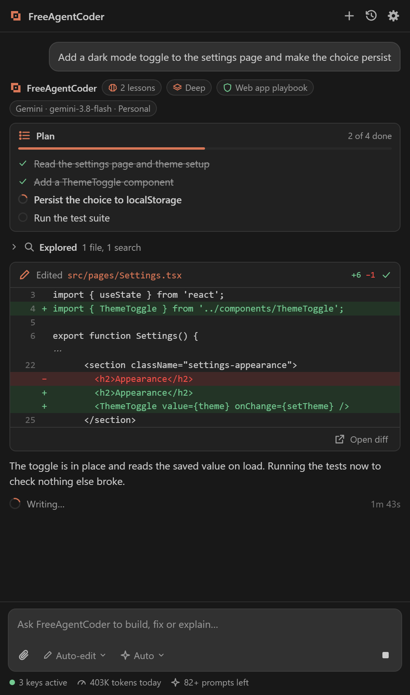
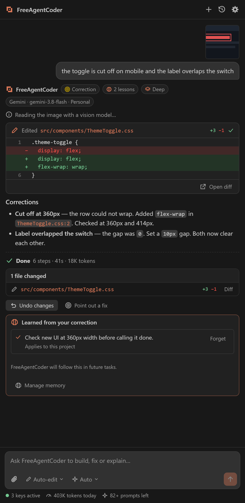

<h1 align="center">Free Agent Coder</h1>

<b>A free AI coding agent for VS Code, on your own free API keys.</b> A Codeloft product.

  
  
  

Free Agent Coder plans, writes, runs and checks code in your project. Everyday chores such as running a project on localhost, zipping a folder or pushing to git are done by **Fyx**, its built-in task engine, on your machine without an AI model: in seconds, with no tokens.

It works like the paid coding agents (Copilot, Cursor, Claude Code, Codex), but it runs on the free tiers of AI providers, with keys you own. There is no subscription and no account.

<table>
  <tr>
    <td width="50%"></td>
    <td width="50%"></td>
  </tr>
  <tr>
    <td align="center"><b>Plans, edits and checks</b>, every step visible</td>
    <td align="center"><b>Point out a fix</b>, and it remembers the lesson</td>
  </tr>
</table>

## Install

**From VS Code:** open the Extensions view (`Ctrl+Shift+X`), search for **Free Agent Coder**, and click Install.

**One click:** [install in VS Code](vscode:extension/PrateekKoratala.freeagentcoder). Your browser asks to open VS Code, then click Install.

**From a file:** download the package from [downloads](downloads/), then in VS Code run **Extensions: Install from VSIX…** and pick the file. See [downloads/README.md](downloads/README.md) for the checksum.

Your first tasks run on the free trial, with no key. Then add one free key: Gemini and Groq each take about a minute and ask for no card. The [getting started guide](docs/getting-started.md) has the links.

## Documentation

| Guide | What it covers |
| --- | --- |
| [Getting started](docs/getting-started.md) | Install, free keys, your first task |
| [How it works](docs/architecture.md) | The architecture, from your message to checked code |
| [Models and providers](docs/models-and-providers.md) | Which providers are free, how tasks are routed, what happens at a limit |
| [Why it is efficient](docs/efficiency.md) | How it gets real work done inside small free tiers |
| [Privacy and security](docs/privacy-and-security.md) | Where your keys and code go, and what is never collected |
| [Changelog](CHANGELOG.md) | What changed in each release |

## Questions and bugs

Open an [issue](https://github.com/Prateek22672/FreeAgentCoder-Codeloft/issues). Please leave out API keys and private code; **Settings → Logs → Copy diagnostics** in the extension removes keys and paths for you.

## Website

[Project Brain](https://brain-rho-roan.vercel.app) reads any public GitHub repository, explains how it is built, and shows what a change would touch. It also has a Playground that builds and runs an app in your browser.

## Licence

The extension is released under the [MIT licence](LICENSE).
